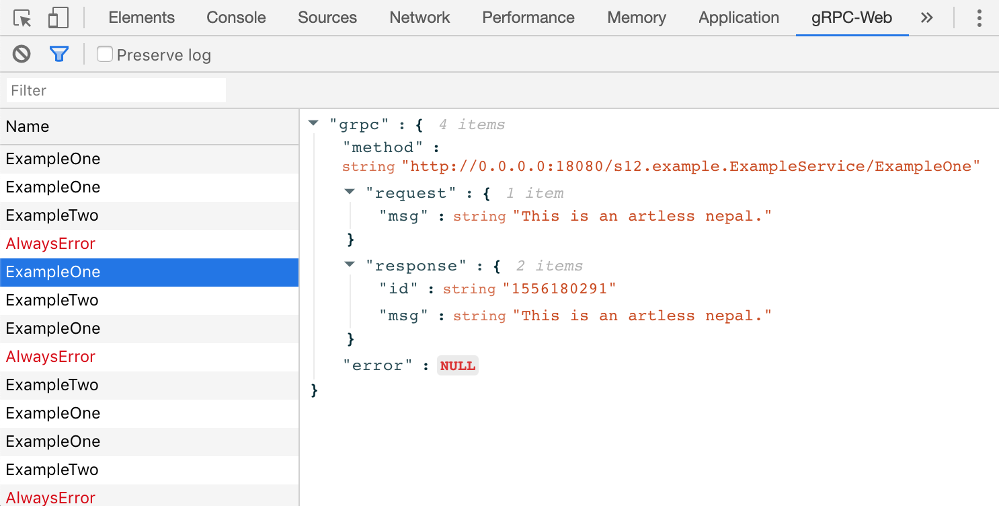

# gRPC-Web Dev Tools

[](http://makeapullrequest.com)




## Installation

### Chrome

Via the [Chrome Web Store](https://chrome.google.com/webstore/detail/grpc-web-developer-tools/ddamlpimmiapbcopeoifjfmoabdbfbjj) (recommended)

or

  1. build it with `make build`
  1. open the **Extension Management** page by navigating to `chrome://extensions`.
  1. enable **Developer Mode** by clicking the toggle switch next to "Developer mode".
  1. Click the **LOAD UNPACKED** button and select the extension `./build` directory.

## Usage

```javascript
const enableDevTools = window.__GRPCWEB_DEVTOOLS__ || (() => {});
const client = new EchoServiceClient('http://myapi.com');
enableDevTools([
  client,
]);
```

## Example
 
The example uses `docker-compose` to start a simple gRPC server, JavaScript client and the Envoy proxy for gRPC-Web:

```bash
make example-up
```

Example will be running on [http://localhost:8080](http://localhost:8080)

To stop the example:

```bash
make example-down
```
