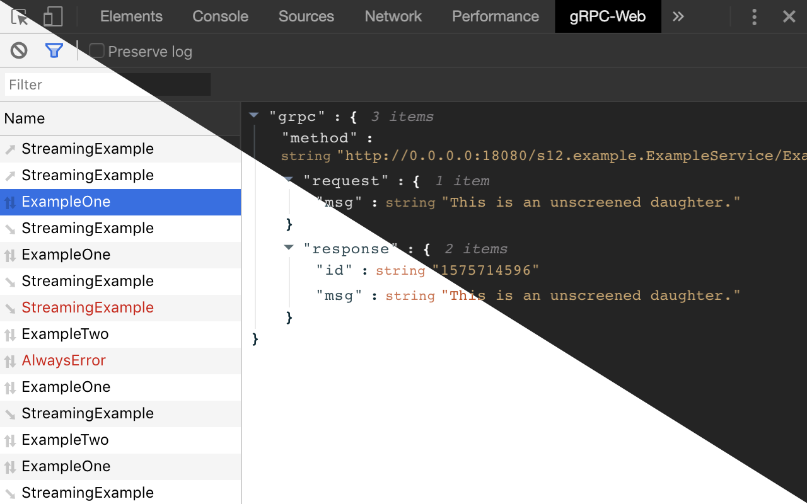

# gRPC-Web Dev Tools

[](http://makeapullrequest.com)


Now supports dark mode.

## Installation

### Chrome

Via
the [Chrome Web Store](https://chrome.google.com/webstore/detail/grpc-web-developer-tools/kanmilmfkjnoladbbamlclhccicldjaj) (
recommended)

or

1. build it with `make build`
1. open the **Extension Management** page by navigating to `chrome://extensions`.
1. enable **Developer Mode** by clicking the toggle switch next to "Developer mode".
1. Click the **LOAD UNPACKED** button and select the extension `./build` directory.

### Firefox

Via [Firefox Browser Add-Ons](https://addons.mozilla.org/en-US/firefox/addon/grpc-web-developer-tools/) (recommended)

or

1. build and package with `make package`
1. enter `about:debugging` in the URL bar of Firefox
1. click **This Firefox** > **Load Temporary Add-on...**
1. select the `grpc-web-devtools.zip` extention file

## Usage

```javascript
const enableDevTools = window.__GRPCWEB_DEVTOOLS__ || (() => {
});
const client = new EchoServiceClient('http://myapi.com');
enableDevTools([
  client,
]);
```

> NOTE: Requires that your generated client(s) use `protoc-gen-grpc-web` >= 1.0.4

## Example

The example uses `docker-compose` to start a simple gRPC server, JavaScript client and the Envoy proxy for gRPC-Web:

```bash
make example-up
```

Example will be running on [http://localhost:8080](http://localhost:8080)

To stop the example:

```bash
make example-down
```

## Connect-Web

grpc-web-devtools now also supports [connect-web](https://github.com/bufbuild/connect-web)!

```ts
// __CONNECT_WEB_DEVTOOLS__ is loaded in as a script, so it is not guaranteed to be loaded before your code.
const interceptors: Interceptor[] = window.__CONNECT_WEB_DEVTOOLS__ !== "undefined" ?
  [window.__CONNECT_WEB_DEVTOOLS__]
  : [];
// To get around the fact that __CONNECT_WEB_DEVTOOLS__ might not be loaded, we can listen for a custom event,
// and then push the interceptor to our array once loaded.
window.addEventListener("connect-web-dev-tools-ready", () => {
  if (typeof window.__CONNECT_WEB_DEVTOOLS__ !== "undefined") {
    interceptors.push(window.__CONNECT_WEB_DEVTOOLS__);
  }
});
// Now we can use the interceptors in our transport
const transport: Transport = createGrpcWebTransport({
  baseUrl: getApiHostname(),
  interceptors,
});
```
This will also work for the connect protocol
```ts
const transport: Transport = ConnectTransportOptions({
  baseUrl: getApiHostname(),
  interceptors,
});
```
